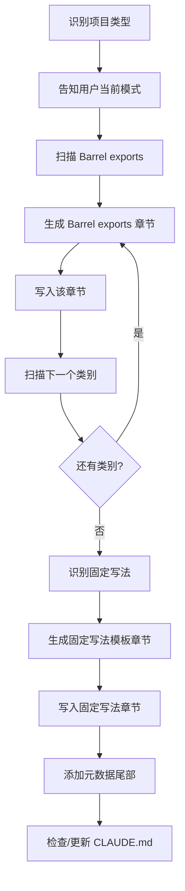

# Codemap — 项目代码地图生成器

生成 `docs/codemap.md`，回答一个核心问题："这个项目有什么可以直接用的，新功能该怎么按规范写？"

这不是 README，不是架构文档，也不是编码规范。它是一份实用参考——工厂函数、可复用组件、运行时 API、工具函数、固定写法模板、类型定义。让新成员（或 AI）拿到就能上手。

## 概述

**采用分章节逐步生成**，每扫描完一个类别并生成内容后立即写入文件，避免上下文过长导致输出中断。

## 模式判断

自动判断运行模式：

1. **检查 `docs/codemap.md` 是否存在**
   - 不存在 → **全量扫描模式**
   - 存在 → 读取文档末尾的 commit hash

2. **如果找到 commit hash**，验证它：
   ```bash
   git log --oneline {hash}..HEAD
   ```
   - hash 有效且有新提交 → **增量更新模式**
   - hash 找不到（比如 rebase 过）→ 降级为**全量扫描模式**
   - hash 有效但没有新提交 → 告知用户"无需更新"，仅刷新 hash 和日期

开始前向用户说明当前模式。

## 全量扫描模式

### 第一步：识别项目类型

读取 `package.json`（或其他语言的清单文件）+ 目录结构：

| 信号 | 类型 |
|------|------|
| `react`/`vue`/`next`/`nuxt`/`angular` + `src/components` 或 `src/pages` | 前端项目 |
| `nestjs`/`express`/`fastify`/`django`/`flask`/`gin` + 无前端框架 | 后端项目 |
| 两者都有 | 全栈项目 |
| 都不符合 | 通用项目（扫描 exports 和公共 API） |

告知用户识别结果后继续。

### 第二步：按类别扫描

不要逐文件遍历，按类别有目的地搜索：

1. **Barrel exports** — 找 `index.ts` / `index.js` / `__init__.py` 等统一导出文件，这些是公共 API 的入口。

2. **工厂函数** — 搜索导出的 `create*`、`define*`、`make*`、`build*` 模式。

3. **Hooks / 组合式函数** — 搜索导出的 `use*`（React/Vue）。

4. **公共组件** — 扫描 shared/common 组件目录，提取组件及其 props。

5. **运行时 API / 服务** — 找到被其他模块调用的导出函数或类。

6. **工具函数** — 扫描 `utils/`、`helpers/`、`lib/`、`libs/` 目录的导出。

7. **中间件 / 装饰器 / 插件** — 框架特有的可复用部分。

8. **类型定义** — 找到跨模块使用的主要 type/interface 导出。

对找到的每个条目，读取源码理解：
- 函数签名（参数、返回值类型）
- 做什么（从代码逻辑判断，不要只靠名字猜）
- 怎么用（grep 找到实际使用示例）

### 第三步：识别固定写法

寻找重复的结构模式——添加新功能时需要遵循的模板：

- 找 2-3 个同类实现（比如多个 workflow 文件、多个 API 端点、同类组件）
- 提取公共骨架
- 记录注册步骤（新实例加到哪个列表/路由/配置）

### 第四步：编写文档

文档结构**不是固定模板**，而是根据扫描结果动态生成。不同项目会产出不同的章节。

**必有部分（所有项目）：**

```markdown
# {项目名} 代码地图

简述：项目类型、核心架构模式、本文档覆盖范围。

## 目录结构
核心目录——开发中经常接触的那些。
```

**动态章节（根据扫描到的内容决定）：**

扫描完成后，将发现的内容按功能职责分组，每组形成一个章节。章节名称应反映项目实际的概念，而不是套用固定术语。

举例说明——不同项目可能产出的章节完全不同：

| 项目特征 | 可能的章节 |
|---------|----------|
| NestJS 后端 | 核心概念、运行时 API、节点工厂函数、工具定义、工具函数、固定写法模板、类型速查 |
| React 前端 | 公共组件（含 Props）、自定义 Hooks、状态管理模式、路由约定、工具函数 |
| Express API | 路由工厂、中间件、验证器、错误处理、数据库模型 |
| Python ML | Pipeline 组件、数据处理函数、模型工具、配置模式 |
| Monorepo | 按包分区，每个包列出公共 API |

**每个章节内，条目格式统一：**
- 函数签名和参数类型
- 一句话说明
- 文件位置
- 使用示例（从代码库中的真实用法提取，不要编造）
- 重要函数给出完整签名；简单工具函数签名 + 说明即可

**两个特殊章节（如果扫描中发现了相关内容）：**

- **固定写法模板** — 找到 3+ 个同构实现时，提取可复制的骨架代码，包含注册步骤
- **类型定义速查** — 跨模块共享的核心类型，附字段说明

判断原则：如果某类内容只有 1-2 个条目，合并到相近章节而不是单独成章。章节数量没有上限也没有下限，完全取决于项目实际内容。

### 文档原则

- **只写"拿来就能用"的内容**——不能直接帮人写代码的内容不收录
- **不写通用编码规范**——TypeScript 风格、异步模式等不是代码地图的内容
- **不写架构设计理念**——那是 README 的职责
- **真实签名、真实示例**——读实际代码，不要猜测或简化
- **按功能分组**——不按文件路径分组

### 分章节输出流程

扫描和生成都按类别分步进行，每完成一个类别立即写入文件：



**写入策略：逐章节追加写入**

每章节生成后，立即用 Bash `cat >>` 追加写入文件。这里刻意使用 `cat >>` 而非 Write/Edit 工具——Write 是整文件覆盖，每次调用需传入全部已有内容；Edit 是字符串替换，不适合纯追加场景。`cat >>` 每次只传当前章节内容，避免上下文膨胀，是分章节写入的最佳方式。

```bash
cat >> "docs/codemap.md" << 'EOF'
## 章节标题
条目内容...
EOF
```

文件不存在时会自动创建。先写入文件头（注意用 `cat >` 创建文件）：

```bash
cat > "docs/codemap.md" << 'EOF'
# {项目名} 代码地图

简述：项目类型、核心架构模式、本文档覆盖范围。

## 目录结构
EOF
```

### 第五步：添加元数据尾部

在文档末尾追加：

```markdown
---
<!-- codemap-meta
commit: {当前 HEAD hash}
updated: {今天日期 YYYY-MM-DD}
-->
```

### 第六步：更新 CLAUDE.md（如果存在）

如果项目根目录有 `CLAUDE.md` 且尚未引用代码地图，添加：

```markdown
## 开发参考

- 在设计方案、规划实施以及编码前，**必须先阅读** `docs/codemap.md` 了解项目的工具函数、工厂函数和固定写法
```

如果 CLAUDE.md 不存在，提醒用户可以考虑创建一个。

## 增量更新模式

### 第一步：识别变更

```bash
git diff {stored_hash}..HEAD --name-only
```

过滤出包含代码地图相关内容的目录中的文件（工厂函数、工具函数、组件、工具、类型）。

### 第二步：评估范围

- **无相关变更** → 仅更新 hash，告知用户
- **超过 30 个相关文件变动** → 建议全量重新生成，询问用户确认
- **其他情况** → 继续增量更新

### 第三步：分析变更

对每个相关的变更文件：
- `git diff {stored_hash}..HEAD -- {file}` 查看具体改动
- 分类：新增导出、修改签名、删除导出、新文件、新目录

### 第四步：应用更新

| 变更类型 | 处理方式 |
|---------|---------|
| 新增工厂函数 / 工具函数 / 组件 | 在对应章节追加条目 |
| 修改已有函数签名 | 更新对应条目 |
| 删除函数 | 从文档中移除 |
| 新文件但无公共导出 | 忽略 |
| 新目录 / 模块 | 评估是否需要更新目录结构章节 |
| 出现新模式（3+ 个同类文件） | 考虑新增固定写法模板 |

先读取现有文档，只修改受影响的章节，其他内容原封不动保留。

### 第五步：更新尾部

更新元数据中的 commit hash 和日期。

## 完成前检查

- [ ] 每个函数签名都与实际源码一致
- [ ] 文档中的文件路径指向真实存在的文件
- [ ] 使用示例来自真实代码（grep 验证）
- [ ] 没有空章节——没有内容就去掉标题
- [ ] 元数据尾部的 commit hash 是当前最新的
- [ ] 增量更新没有误删或重复条目

## 常见错误

| 错误 | 修正 |
|------|------|
| 一次性生成所有章节 | 必须分章节扫描和写入，每章节完成后立即追加到文件 |
| 扫描时逐文件遍历 | 按类别搜索，不要逐文件遍历 |
| 不读取源码只靠名字猜 | 必须读取实际代码理解函数行为 |
