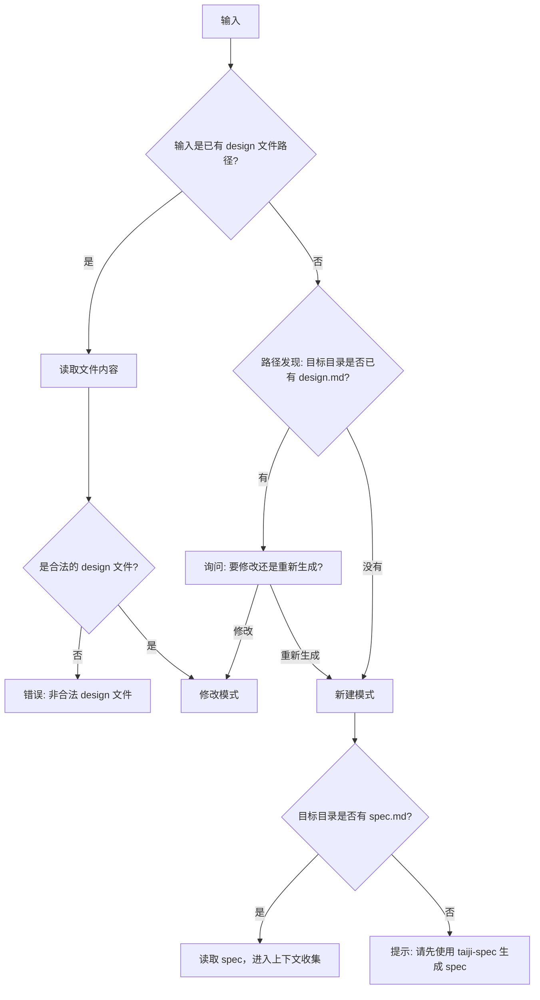
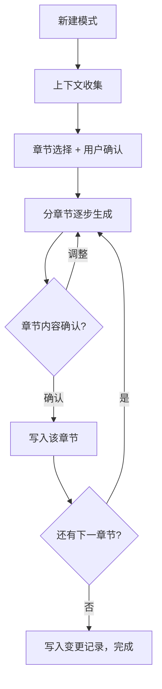
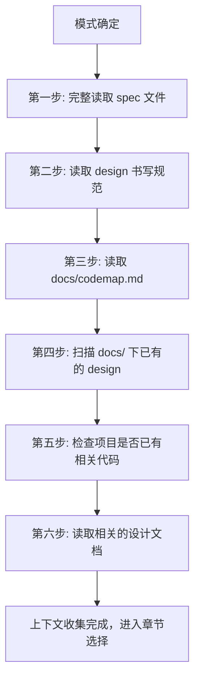
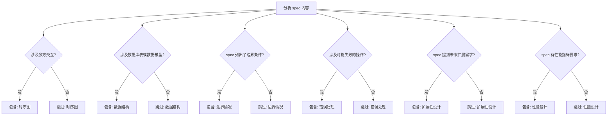
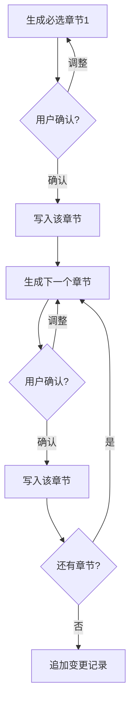
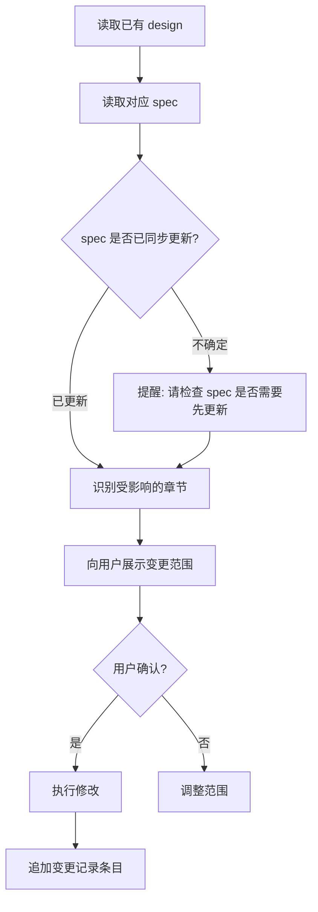

# taiji-design 设计文档生成技能

## 概述

根据团队设计文档规范，生成或修改 design 文档。自动读取 spec 内容、收集项目上下文（代码、历史 design），并智能选择需要包含的可选章节。

**新建模式采用分章节逐步输出**，每章节生成后立即写入文件，避免长文档输出中断导致内容丢失。

## 使用场景

- 用户说"帮我写个 design"、"生成设计文档"、"写个技术方案"或 "/taiji-design"
- 用户提供 spec 并要求生成设计文档
- 用户要修改已有的 design 并追加变更记录
- spec 已 approved，准备进入 design 阶段

**不适用：**
- 还没有 spec — 建议先使用 taiji-spec
- 用户要求写的是 spec/plan/test 文档

## 核心流程

### 路径发现

Design 文档统一存放在 `docs/<feature-name>/` 目录下，与 Spec 同目录。路径发现优先级：

1. 用户显式指定了文件路径 → 直接使用
2. 用户指定了 feature 名称 → `docs/<feature-name>/design.md`
3. 用户提供了 spec 路径 → 从 spec 所在目录推导（如 `docs/export-excel/spec.md` → `docs/export-excel/design.md`）
4. 以上都没有 → 扫描 `docs/` 下有 spec.md 但没有 design.md 的目录，列出供用户选择
5. 仍无法确定 → 询问用户 feature 名称，按 kebab-case 创建目录

### 模式判断



### 新建模式完整流程



### 上下文收集流程（关键步骤）

写任何 design 内容之前，必须先收集上下文：



**上下文收集不可跳过。** 这是没有 skill 时最常见的遗漏。

| 步骤 | 读取内容 | 原因 |
|------|---------|------|
| 读取 spec | 完整的 spec.md 文件 | design 必须覆盖 spec 中每个需求点 |
| 读取规范 | docs/standards/design-standard.md | 确保模板合规 |
| 读取 codemap | docs/codemap.md（如存在） | 了解项目可复用的工具函数、工厂函数和固定写法，避免重复造轮子 |
| 扫描已有 design | docs/ 下其他 design.md 文件 | 保持风格和深度一致 |
| 检查代码 | 项目 src/ 目录结构 | design 应与已有架构对齐 |
| 读取相关文档 | 同一 feature 的其他文档 | 确保跨文档一致性 |

### 章节选择流程

上下文收集后，分析 spec 内容来决定包含哪些可选章节：



**选择结果必须展示给用户确认：**

```
基于 spec 分析，计划包含以下章节：
- [必选] 需求简述
- [必选] 业务逻辑（模块划分 + 核心流程）
- [包含] 时序图 — 原因: 涉及前端、Controller、Service 等多方交互
- [包含] 数据结构 — 原因: 需要新建 export_task 表
- [跳过] 扩展性设计 — 原因: spec 无扩展性要求
- [包含] 性能设计 — 原因: spec 要求"10万条30秒内"
- [必选] 变更记录

确认？（确认 / 调整）
```

### 分章节输出流程（新建模式）

章节选择确认后，按顺序逐章节生成和写入：



**写入策略：逐章节追加写入**

每章节生成并确认后，立即用 Bash `cat >>` 追加写入文件。这里刻意使用 `cat >>` 而非 Write/Edit 工具——Write 是整文件覆盖，每次调用需传入全部已有内容；Edit 是字符串替换，不适合纯追加场景。`cat >>` 每次只传当前章节内容，避免上下文膨胀，是分章节写入的最佳方式。

```bash
cat >> "docs/<feature-name>/design.md" << 'EOF'
## 章节标题
章节内容...
EOF
```

文件不存在时会自动创建。第一章节写入前先写入 frontmatter（注意用 `cat >` 创建文件）：

```bash
cat > "docs/<feature-name>/design.md" << 'EOF'
---
title: {{title}}
spec: ./spec.md
status: draft
created: YYYY-MM-DD
updated: YYYY-MM-DD
author: {{author}}
---
EOF
```

### 修改模式流程



**修改模式必须：**
1. 检查对应的 spec 是否已同步更新
2. 展示变更范围后再修改
3. 追加（不是替换）变更记录条目

## 速查表

| 项目 | 规则 |
|------|------|
| **前提** | 必须先有 spec 才能写 design |
| **输出目录** | `docs/<feature-name>/design.md`，与 spec 同目录，feature-name 使用 kebab-case |
| **文件名** | 固定 `design.md` |
| **作者** | 自动读取 `git config user.name` |
| **spec 字段** | 指向对应 spec 的相对路径（如 `./spec.md`） |
| **图表格式** | 仅限 Mermaid（flowchart、sequenceDiagram、erDiagram） |

### 快速模式

当用户明确表示信任 AI 输出（如"直接生成"、"不用确认"、"快速模式"），可以合并确认步骤：跳过中间章节逐一确认，一次性生成所有章节内容，仅在最终输出时请用户确认。分章节写入仍然保留（每章节生成后立即写入），只是省去中间的确认等待。

### 关键交互节点

| 节点 | 询问 | 选项 |
|------|------|------|
| 章节选择 | "基于 spec 分析，包含以下章节？" | 确认 / 调整 |
| 章节确认 | "## [章节名] 内容如下，确认？" | 确认 / 调整 |
| 输出确认 | "写入文件还是先预览？"（修改模式） | 写入 / 预览 / 修改后写入 |
| 修改: spec 检查 | "对应 spec 是否已更新？" | 已更新 / 需要先更新 spec |
| 修改: 范围确认 | "以下章节将被修改：" | 确认 / 调整 |

### Frontmatter 模板

```yaml
---
title: [从 spec 读取标题]
spec: [spec.md 的相对路径]
status: draft
created: YYYY-MM-DD
updated: YYYY-MM-DD
author: [git user.name]
---
```

### 变更记录追加规则

```markdown
| {{today}} | {{author}} | {{变更描述}} |
```

## 常见错误

| 错误 | 修正 |
|------|------|
| 不读 spec 原文就开始写 | 必须先完整读取 spec，不能只靠用户口述 |
| 跳过上下文收集 | 必须扫描已有 design 和代码再动笔 |
| 无脑包含所有可选章节 | 分析 spec 后判断，并向用户确认 |
| 不确认就直接写文件 | 必须先预览或确认后再写入 |
| 修改时替换变更记录 | 追加新行，不替换已有记录 |
| 修改 design 不检查 spec | 必须先确认 spec 是否已同步更新 |
| 使用非 Mermaid 图表 | 所有图表必须用 Mermaid 格式 |
| 新建模式不分章节一次性生成 | 必须分章节逐步生成，每章确认后立即写入 |

## 子模块引用

- 章节选择逻辑: `taiji-design/section-selector.md` — 进入章节选择流程时读取，获取可选章节的详细判断规则
- 模板: `taiji-design/templates/design-template.md` — 开始生成文档内容时读取模板
