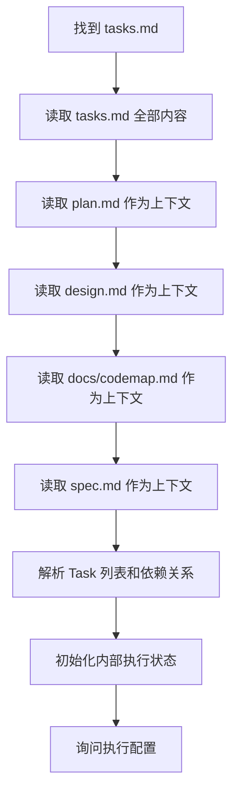
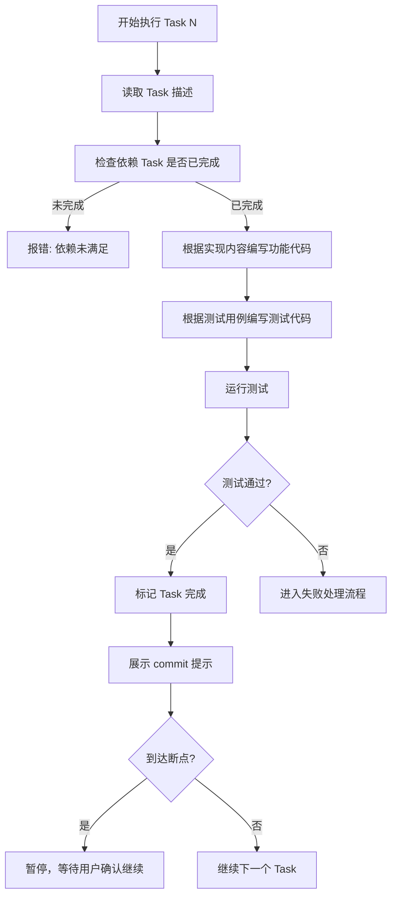
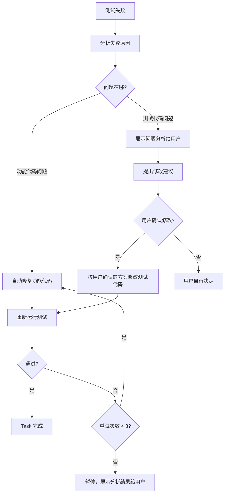

# taiji-execute 编码执行技能

## 概述

根据 tasks.md 中的任务描述，逐个执行编码工作——编写功能代码和对应的测试代码，运行测试验证，最终输出执行报告。支持逐个 Task 或按阶段批量执行，支持断点控制和智能失败处理。

## 使用场景

- 用户说"开始写代码"、"执行 plan"、"按 task 开发"或 "/taiji-execute"
- Tasks 已 approved，准备进入编码阶段
- 需要继续执行中断的 Task
- 需要重新执行某个失败的 Task

**不适用：**
- 还没有 tasks.md — 建议先使用 taiji-plan 生成
- 用户要求写 spec/design/plan 文档
- 纯粹的 bug 修复（不在 tasks 范围内）

## 核心流程

### 路径发现

与其他 taiji skill 一致，文档统一在 `docs/<feature-name>/` 下。路径发现优先级：

1. 用户显式指定了 tasks.md 路径 → 直接使用
2. 用户指定了 feature 名称 → `docs/<feature-name>/tasks.md`
3. 以上都没有 → 扫描 `docs/` 下有 tasks.md 且 status 为 approved 的目录，列出供用户选择
4. 仍无法确定 → 询问用户 feature 名称

### 执行前准备



**执行配置询问：**

```
准备执行以下 Tasks：
- Task 1：xxx（无依赖）
- Task 2：xxx（依赖 Task 1）
- Task 3：xxx（无依赖，可与 Task 1 并行）
...

请选择执行方式：
1. 逐个 Task 执行（每个 Task 完成后可检查）
2. 按阶段批量执行（同阶段的 Task 连续完成后统一检查）

是否需要在某些 Task 后设置断点？（输入 Task 编号，如 "3,5"，或 "无"）
```

### 单个 Task 执行流程



### 编码原则

每个 Task 的产出包含两部分：**功能代码**和**测试代码**，缺一不可。

**功能代码：**
- 严格按 Task 的"实现内容"编写：函数签名、参数类型、返回值、SQL 等必须与 tasks.md 中的定义一致
- 先写功能代码，确保编译/语法通过后再写测试代码
- 不扩展范围：只实现当前 Task 描述的内容，不添加额外功能
- 与已有代码保持一致：遵循项目现有的代码风格、命名规范、目录结构

**测试代码：**
- 严格按 Task 的"测试用例"编写：每个用例对应一个独立的测试方法
- 测试方法命名要能体现测试场景（如 `test_queryByPage_returnsCorrectData`、`test_queryByPage_emptyResult`）
- 测试文件路径必须与 Task 中"涉及文件"描述的测试文件一致
- 测试必须能独立运行，不依赖其他 Task 的测试
- 使用项目已有的测试框架和工具（如 JUnit、pytest、Jest 等），不引入新的测试依赖

### 失败处理流程



**关键原则：功能代码可以自动修复重试，测试用例是验收标准，修改必须经用户确认。**

失败分析需展示：
- 哪个测试用例失败了
- 失败的具体错误信息
- 问题根因分析（是功能代码 bug 还是测试代码问题）
- 建议的修复方案

### 执行状态管理

skill 内部维护每个 Task 的执行状态，不修改 tasks.md 原文。

**内部状态结构：**

```json
{
  "feature": "export-excel",
  "started_at": "2026-04-07T10:00:00",
  "tasks": [
    {
      "id": 1,
      "name": "创建 export_task 表",
      "status": "completed",
      "files_created": ["src/main/resources/db/migration/V20260401__create_export_task.sql"],
      "test_files_created": ["src/test/java/com/example/dao/ExportTaskMigrationTest.java"],
      "files_modified": [],
      "tests_passed": 3,
      "tests_total": 3,
      "retry_count": 0,
      "completed_at": "2026-04-07T10:05:00"
    },
    {
      "id": 2,
      "name": "实现 UserQueryDAO",
      "status": "in_progress",
      "files_created": [],
      "files_modified": [],
      "tests_passed": 0,
      "tests_total": 0,
      "retry_count": 0
    }
  ]
}
```

状态值：`pending` / `in_progress` / `completed` / `failed` / `skipped`

### Commit 提示

每个 Task 完成后（或每个阶段完成后），展示 commit 提示：

```
Task 1 完成，建议提交：

git add src/main/resources/db/migration/V20260401__create_export_task.sql
git add src/test/java/com/example/dao/ExportTaskMigrationTest.java

git commit -m "feat(export): 创建 export_task 表及索引

- 新建 export_task 表，包含 user_id, filter_params, status 等字段
- 添加 idx_user_id 和 idx_status 索引
- 对应 Task 1（Plan 阶段1-步骤1.1）"
```

### 执行报告

所有 Task 执行完毕后（或用户主动终止时），生成代码实现报告并写入 `docs/<feature-name>/code-report.md`。

**Code Report 包含以下章节（按模板 `templates/code-report-template.md` 生成）：**

1. **执行概览** — 统计数据：总 Task 数、完成/失败/跳过数、测试用例通过率
2. **Task 执行明细** — 每个 Task 的状态、新增/修改的文件、测试结果、重试次数
3. **失败 Task 分析**（如有）— 失败原因、错误信息、尝试的修复、建议后续处理
4. **验收结论** — 将 Spec 中的每条验收标准与对应的 Task 和测试结果对齐，给出整体是否可交付的结论、遗留问题和建议后续
5. **Commit 建议** — 汇总所有 Task 的 git add + commit 命令
6. **变更记录** — 报告自身的变更记录

验收结论需要读取 Spec 的验收标准，与执行结果逐条比对。报告其余数据来源于执行过程中维护的内部状态（见"执行状态管理"）。

## 速查表

| 项目 | 规则 |
|------|------|
| **前提** | 必须先有 approved 的 tasks.md |
| **输入** | tasks.md（必须），plan.md / design.md / spec.md（上下文） |
| **输出** | 功能代码 + 测试代码 + Code Report |
| **报告位置** | `docs/<feature-name>/code-report.md` |
| **Commit** | 不自动 commit，给出 git add + commit 命令提示 |
| **测试用例** | 验收标准，修改必须经用户确认 |

### 关键交互节点

| 节点 | 询问 | 选项 |
|------|------|------|
| 执行方式 | "逐个 Task 还是按阶段批量？" | 逐个 / 按阶段 |
| 断点设置 | "是否在某些 Task 后设置断点？" | Task 编号 / 无 |
| 断点暂停 | "Task N 完成，继续执行？" | 继续 / 暂停 |
| 测试失败 | "功能代码问题，自动修复中..." | 自动进行 |
| 测试代码问题 | "测试用例可能需要调整，建议：..." | 确认修改 / 拒绝 / 自行决定 |
| 重试耗尽 | "已重试 3 次仍未通过，需要介入" | 用户决定 |

## 常见错误

| 错误 | 修正 |
|------|------|
| 不读上下文直接写代码 | 必须先读取 spec/design/plan/tasks 全套文档 |
| 超出 Task 描述范围写代码 | 严格按 Task 的实现内容编写，不扩展 |
| 自动修改测试用例 | 测试用例是验收标准，修改必须经用户确认 |
| 跳过依赖未完成的 Task | 必须检查依赖，依赖未满足不能执行 |
| 不运行测试就标记完成 | 每个 Task 必须运行测试并通过 |
| 忘记生成 Code Report | 执行结束后必须生成报告到 docs 目录 |

## 子模块引用

- Code Report 模板: `taiji-execute/templates/code-report-template.md`
