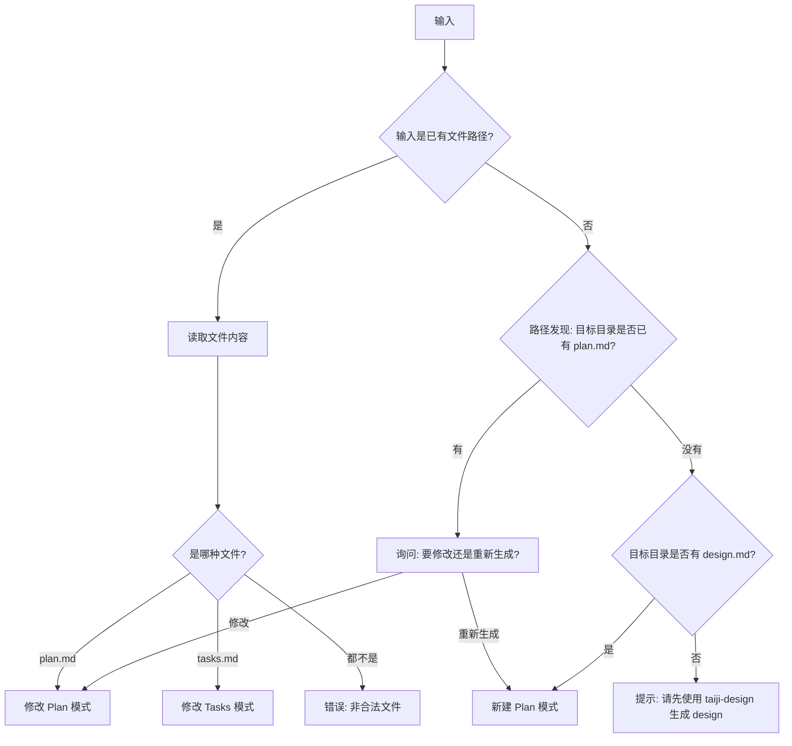
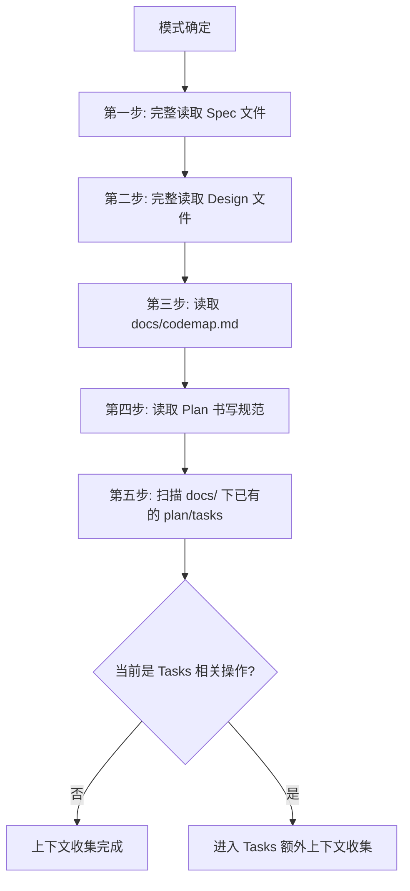
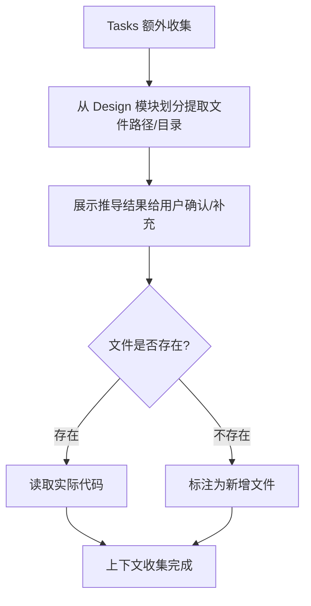
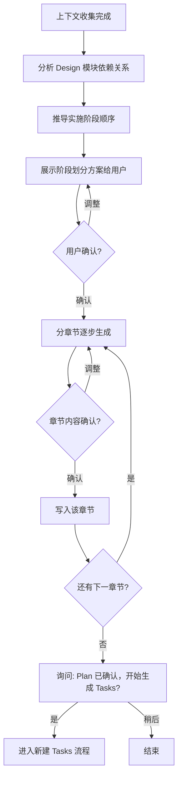
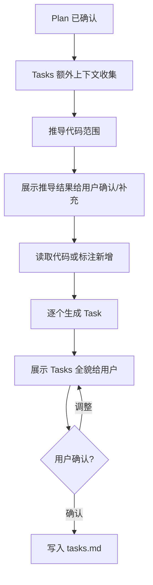
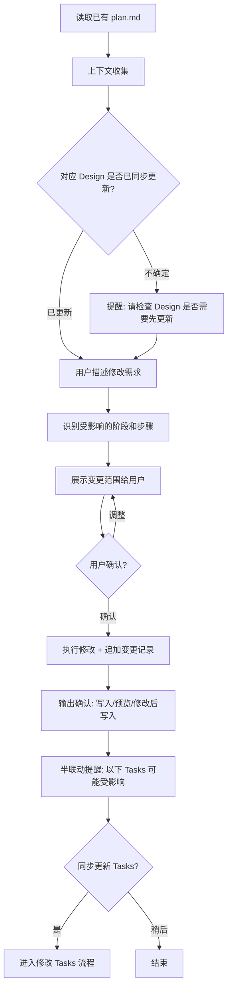
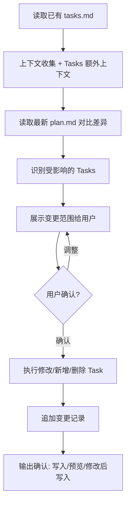

# taiji-plan 实施计划生成技能

## 概述

根据团队 Plan 书写规范，生成或修改 plan 和 tasks 文档。自动读取 Spec、Design 内容，收集项目上下文（代码、已有文档），支持分步生成（Plan 确认后衔接 Tasks）和半联动修改。

**新建模式采用分章节逐步输出**，每章节生成后立即写入文件，避免长文档输出中断导致内容丢失。

## 使用场景

- 用户说"帮我写个 plan"、"生成实施计划"、"拆分任务"或 "/taiji-plan"
- Design approved 后，准备生成实施计划
- 需要修改已有的 Plan 或 Tasks
- Design 变更后需要同步更新 Plan/Tasks

**不适用：**
- 还没有 Design — 建议先使用 taiji-design
- 用户要求写 spec/design/test 文档

## 核心流程

### 路径发现

Plan 和 Tasks 文档统一存放在 `docs/<feature-name>/` 目录下，与 Spec/Design 同目录。路径发现优先级：

1. 用户显式指定了文件路径 → 直接使用
2. 用户指定了 feature 名称 → `docs/<feature-name>/plan.md`
3. 用户提供了 design 路径 → 从 design 所在目录推导（如 `docs/export-excel/design.md` → `docs/export-excel/plan.md`）
4. 以上都没有 → 扫描 `docs/` 下有 design.md 但没有 plan.md 的目录，列出供用户选择
5. 仍无法确定 → 询问用户 feature 名称，按 kebab-case 定位目录

### 模式判断



**关键点：** 不论新建还是修改，Plan 操作完成并经用户确认后，自动衔接进入对应的 Tasks 操作。

### 上下文收集（关键步骤）

写任何内容之前，必须先收集上下文。收集范围因模式而异。

**通用上下文（所有模式必须）：**



| 步骤 | 读取内容 | 原因 |
|------|---------|------|
| 读取 Spec | 完整的 spec.md | 验证点和测试用例的"正确答案"来源于验收标准 |
| 读取 Design | 完整的 design.md | Plan 的直接输入，阶段和步骤来源于模块划分和核心流程 |
| 读取 codemap | docs/codemap.md（如存在） | 了解项目可复用的工具函数和固定写法，Tasks 的实现内容应优先使用已有工具 |
| 读取规范 | docs/standards/plan-standard.md | 确保模板合规 |
| 扫描已有文档 | docs/ 下其他 plan.md / tasks.md | 保持风格和深度一致 |

**Tasks 额外上下文（生成/修改 Tasks 时）：**



| 步骤 | 读取内容 | 原因 |
|------|---------|------|
| 推导代码范围 | 从 Design 的模块划分提取文件路径/目录 | Tasks 需要具体到函数、接口、SQL |
| 用户确认 | 展示推导结果，用户可补充/调整 | 自动推导可能遗漏 |
| 读取代码 | 用户确认后的文件/目录 | 确保文件路径、函数签名与实际代码一致 |

**上下文收集不可跳过。** 无代码时基于 Design 推导，有代码时基于实际代码。

### 新建 Plan 流程



**阶段推导逻辑：**
- 从 Design 的模块划分提取各模块
- 从 Design 的核心流程/时序图推导模块间依赖
- 被依赖最多的模块排在前面（如数据层通常先于服务层）
- 无依赖关系的模块标注为可并行

**阶段划分需展示给用户确认：**

```
基于 Design 分析，计划分为以下阶段：
阶段1：[名称] — 理由：[为什么先做]
阶段2：[名称] — 理由：[排序理由]
...
确认？（确认 / 调整）
```

**生成内容包含：**
- 需求简述（从 Spec 提取）
- 前置条件（从 Design 推导环境、配置、权限依赖）
- 实施阶段（每阶段含步骤 + 验证点 + 排序理由）
- 并行策略（如有可并行的阶段/步骤）
- 风险与应对（从 Design 的技术选型和复杂点推导）
- 变更记录

### 新建 Tasks 流程



**Task 生成逻辑：**
- Plan 的每个步骤对应一个或多个 Task（简单步骤 1:1，复杂步骤可拆分）
- 有代码时：读取实际函数签名、类结构，生成准确的修改内容
- 无代码时：基于 Design 的模块划分和数据结构推导函数签名、SQL
- 测试用例从 Spec 验收标准 + Plan 验证点推导
- 每个 Task 包含：操作类型、涉及文件、实现内容（具体到函数签名/SQL/接口定义）、测试用例、依赖

### 分章节输出流程（新建模式）

**写入策略：逐章节追加写入**

每章节生成并确认后，立即用 Bash `cat >>` 追加写入文件。这里刻意使用 `cat >>` 而非 Write/Edit 工具——Write 是整文件覆盖，每次调用需传入全部已有内容；Edit 是字符串替换，不适合纯追加场景。`cat >>` 每次只传当前章节内容，避免上下文膨胀，是分章节写入的最佳方式。

```bash
cat >> "docs/<feature-name>/plan.md" << 'EOF'
## 章节标题
章节内容...
EOF
```

文件不存在时会自动创建。第一章节写入前先写入 frontmatter（注意用 `cat >` 创建文件）：

```bash
cat > "docs/<feature-name>/plan.md" << 'EOF'
---
title: {{title}}
design: ./design.md
status: draft
created: YYYY-MM-DD
updated: YYYY-MM-DD
author: {{author}}
---
EOF
```

Tasks 写入同理，使用 `cat >> "docs/<feature-name>/tasks.md"`。

### 修改 Plan 流程



**修改模式必须：**
1. 检查对应的 Design 是否已同步更新
2. 展示变更范围后再修改
3. 追加（不是替换）变更记录条目

**半联动提醒格式：**

```
Plan 已修改，以下 Tasks 可能受影响：
- Task 3（对应阶段2-步骤2.1）— 实现内容可能需调整
- Task 5（新增）— 对应 Plan 新增步骤2.3
是否同步更新 Tasks？（是 / 稍后）
```

### 修改 Tasks 流程



**修改 Tasks 可能的操作：**
- 修改已有 Task 的实现内容/测试用例
- 新增 Task（对应 Plan 新增的步骤）
- 删除已废弃的 Task（对应 Plan 删除的步骤）
- 调整 Task 间的依赖关系

**独立入口：** 用户直接传入 tasks.md 路径时，跳过 Plan 联动，直接进入修改 Tasks 流程。但仍需提醒"对应 Plan 是否已更新？"，确保 Tasks 与 Plan 保持一致。

## 速查表

| 项目 | 规则 |
|------|------|
| **前提** | 必须先有 Design 才能写 Plan |
| **输出目录** | `docs/<feature-name>/`，与 Spec/Design 同目录，feature-name 使用 kebab-case |
| **文件名** | Plan 固定 `plan.md`，Tasks 固定 `tasks.md` |
| **作者** | 自动读取 `git config user.name` |
| **design 字段** | Plan frontmatter 指向对应 design 的相对路径（如 `./design.md`） |
| **plan 字段** | Tasks frontmatter 指向对应 plan 的相对路径（如 `./plan.md`） |
| **图表格式** | 仅限 Mermaid |

### 快速模式

当用户明确表示信任 AI 输出（如"直接生成"、"不用确认"、"快速模式"），可以合并确认步骤：跳过中间章节逐一确认，一次性生成所有章节内容，仅在最终输出时请用户确认。分章节写入仍然保留（每章节生成后立即写入），只是省去中间的确认等待。Plan→Tasks 衔接仍需确认。

### 关键交互节点汇总

| 节点 | 询问 | 选项 |
|------|------|------|
| 模式判断 | "已有 plan，要修改还是重新生成？" | 修改 / 重新生成 |
| 阶段划分 | "基于 Design 分析，分为以下阶段？" | 确认 / 调整 |
| 章节确认 | "## [章节名] 内容如下，确认？" | 确认 / 调整 |
| 代码范围 | "推导以下文件相关，请确认/补充" | 确认 / 补充 |
| Tasks 确认 | "以下 Tasks 是否合适？" | 确认 / 调整 |
| 输出确认 | "写入文件还是先预览？"（修改模式） | 写入 / 预览 / 修改后写入 |
| Plan→Tasks 衔接 | "Plan 已确认，开始生成 Tasks？" | 是 / 稍后 |
| 修改: Design 检查 | "对应 Design 是否已更新？" | 已更新 / 需要先更新 |
| 修改: 变更范围 | "以下内容将被修改：" | 确认 / 调整 |
| 修改: Tasks 联动 | "以下 Tasks 可能受影响，同步更新？" | 是 / 稍后 |

### Frontmatter 模板

**Plan:**
```yaml
---
title: [从 Design 读取标题]
design: [design.md 的相对路径]
status: draft
created: YYYY-MM-DD
updated: YYYY-MM-DD
author: [git user.name]
---
```

**Tasks:**
```yaml
---
title: [从 Plan 读取标题]
plan: [plan.md 的相对路径]
status: draft
created: YYYY-MM-DD
updated: YYYY-MM-DD
author: [git user.name]
---
```

### 变更记录追加规则

```markdown
| {{today}} | {{author}} | {{变更描述}} |
```

## 常见错误

| 错误 | 修正 |
|------|------|
| 不读 Design 就开始写 Plan | 必须先完整读取 Design 和 Spec |
| 跳过上下文收集 | 必须扫描已有 Plan/Tasks 和代码再动笔 |
| 生成 Tasks 不读代码 | 有代码时必须读取，确保文件路径和函数签名准确 |
| Plan 和 Tasks 一次性全生成 | 分步：Plan 确认后再生成 Tasks |
| 修改 Plan 不提醒 Tasks 影响 | 必须识别受影响 Tasks 并提醒用户 |
| 修改时替换变更记录 | 追加新行，不替换已有记录 |
| 修改 Plan 不检查 Design | 必须先确认 Design 是否已同步更新 |
| Tasks 实现内容不够具体 | 必须具体到函数签名、SQL、接口定义，不留模糊空间 |
| 新建模式不分章节一次性生成 | 必须分章节逐步生成，每章确认后立即写入 |

## 子模块引用

- Plan 模板: `taiji-plan/templates/plan-template.md`
- Tasks 模板: `taiji-plan/templates/tasks-template.md`

### 模板注入

替换模板中的 `{{placeholder}}`：

**Plan 模板：**
- `{{title}}` → 从 Design 读取标题
- `{{design_path}}` → Design 文件的相对路径
- `{{summary}}` → 从 Spec 提取需求简述
- `{{prerequisites}}` → 从 Design 推导前置条件
- `{{stage_name}}` → 阶段名称
- `{{stage_goal}}` → 阶段目标
- `{{stage_reason}}` → 排序理由
- `{{step_description}}` → 步骤描述
- `{{verification_behavior}}` → 具体的验证行为
- `{{parallel_strategy}}` → 并行策略说明（无则删除该章节）
- `{{risk}}` / `{{affected_stage}}` / `{{mitigation}}` → 风险表格内容
- `{{author}}` → `git config user.name`
- `{{created}}` / `{{updated}}` → 日期 YYYY-MM-DD

**Tasks 模板：**
- `{{title}}` → 从 Plan 读取标题
- `{{plan_path}}` → Plan 文件的相对路径
- `{{task_name}}` → 任务名称
- `{{stage_step_ref}}` → 对应 Plan 的阶段-步骤引用（如"阶段1-步骤1.1"）
- `{{file_path}}` → 涉及的文件路径，标注（新增）或（修改）
- `{{implementation_detail}}` → 具体实现内容（函数签名、SQL、接口定义）
- `{{scenario}}` → 测试场景
- `{{expected_result}}` → 期望结果
- `{{dependency}}` → 依赖的 Task 编号，无则填"无"
- `{{author}}` → `git config user.name`
- `{{created}}` / `{{updated}}` → 日期 YYYY-MM-DD
