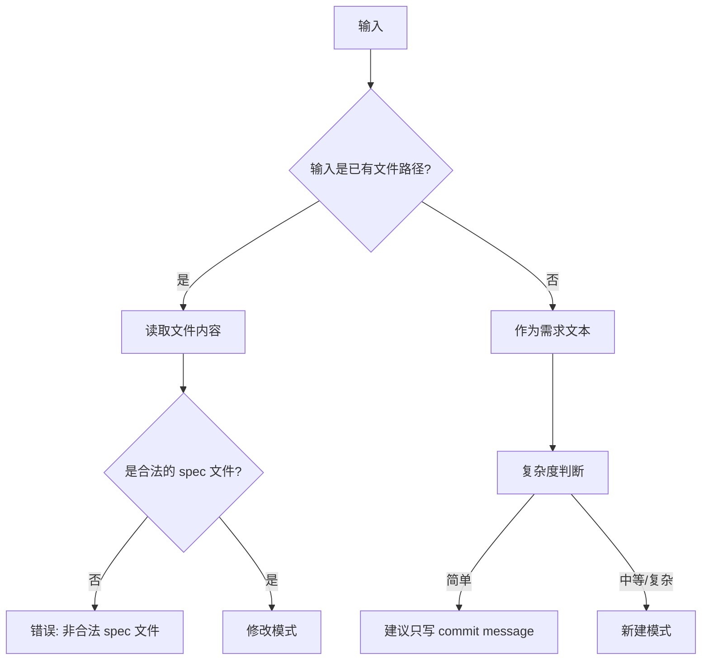
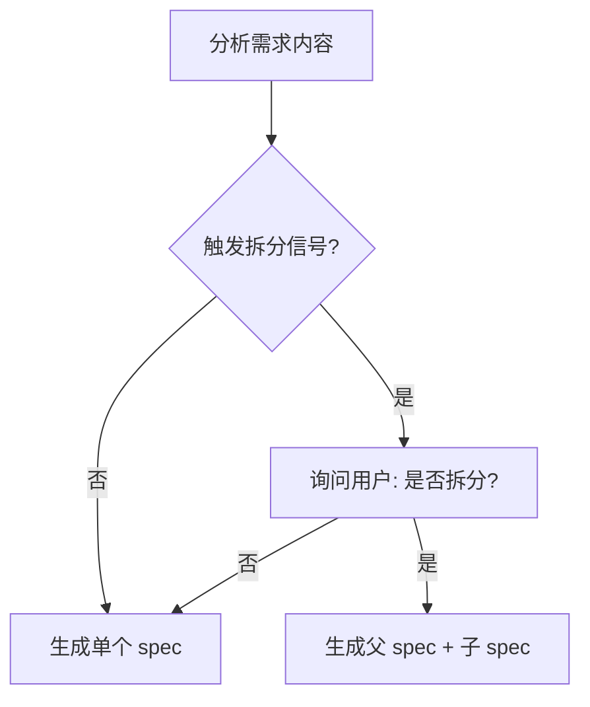
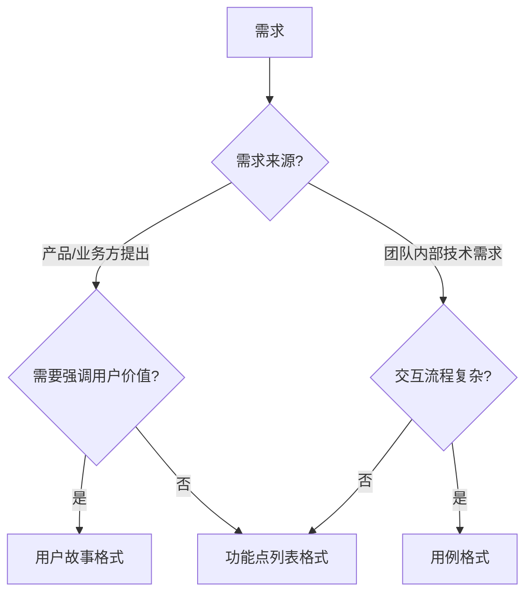
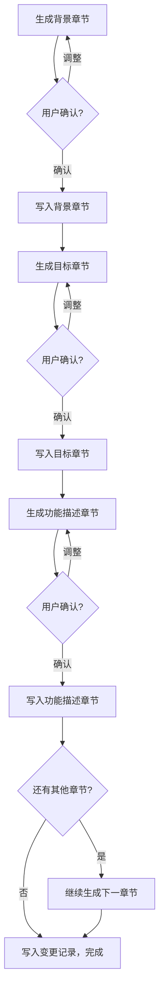

# taiji-spec 需求文档生成技能

## 概述

根据团队 Spec 书写规范，生成或修改 spec 文档。支持两种模式：根据需求描述新建 spec，或修改已有 spec 并自动追加变更记录。内置大需求拆分判断和功能描述格式选择。

**新建模式采用分章节逐步输出**，每章节生成后立即写入文件，避免长文档输出中断导致内容丢失。

## 使用场景

- 用户说"帮我写个 spec"、"生成需求文档"、"写个需求说明"或 "/taiji-spec"
- 用户提供需求描述并要求生成 spec
- 用户要修改已有的 spec 并追加变更记录
- 大需求需要拆分为父 spec + 多个子 spec

**不适用：**
- 简单任务（修 bug、改配置）— 建议只写 commit message
- 用户要求写 design/plan/test 文档

## 核心流程

### 第一步：识别项目类型

在开始生成任何内容之前，先识别当前项目的类型：

| 信号 | 类型 |
|------|------|
| `package.json` + `react`/`vue`/`next`/`nuxt`/`angular` + `src/components` 或 `src/pages` | 前端项目 |
| `go.mod` / `pom.xml` / `requirements.txt` / `Cargo.toml` + 无前端框架 | 后端项目 |
| 同时存在前端和后端特征 | 全栈项目 |
| 都不符合 | 通用项目 |

**识别方式：**扫描项目根目录的特征文件。

识别后明确告知用户当前项目类型，并说明后续所有内容（背景、目标、功能描述、验收标准）均只生成当前类型相关描述，不再混入其他类型。

### 第二步：路径发现

Spec 文档统一存放在 `docs/<feature-name>/` 目录下。路径发现优先级：

1. 用户显式指定了文件路径 → 直接使用
2. 用户指定了 feature 名称 → `docs/<feature-name>/spec.md`
3. 以上都没有 → 询问用户 feature 名称，按 kebab-case 创建目录

### 第三步：模式判断



### 第四步：拆分判断流程



**拆分信号：**
- 独立功能点 > 5 个
- 数据库表变更 > 3 张表
- 涉及独立模块/服务 > 3 个
- 可独立交付的子功能 > 2 个

### 第五步：格式选择流程



### 第六步：分章节输出流程（新建模式）

新建 spec 时，采用分章节逐步生成 + 立即写入的方式：



**写入策略：逐章节追加写入**

每章节生成并确认后，立即用 Bash `cat >>` 追加写入文件。这里刻意使用 `cat >>` 而非 Write/Edit 工具——Write 是整文件覆盖，每次调用需传入全部已有内容；Edit 是字符串替换，不适合纯追加场景。`cat >>` 每次只传当前章节内容，避免上下文膨胀，是分章节写入的最佳方式。

```bash
cat >> "docs/<feature-name>/spec.md" << 'EOF'
## 章节标题
章节内容...
EOF
```

文件不存在时会自动创建。第一章节写入前先写入 frontmatter（注意用 `cat >` 创建文件）：

```bash
cat > "docs/<feature-name>/spec.md" << 'EOF'
---
title: {{title}}
status: draft
created: YYYY-MM-DD
updated: YYYY-MM-DD
author: {{author}}
---
EOF
```

## 速查表

| 项目 | 规则 |
|------|------|
| **标题** | 自动提取，用户可覆盖 |
| **输出目录** | `docs/<feature-name>/spec.md`，feature-name 使用 kebab-case |
| **文件名** | 固定 `spec.md` |
| **作者** | 自动读取 `git config user.name` |
| **parent 字段** | 子 spec → 父 spec 的相对路径；父 spec → 留空 |

### 快速模式

当用户明确表示信任 AI 输出（如"直接生成"、"不用确认"、"快速模式"），可以合并确认步骤：跳过中间章节逐一确认，一次性生成所有章节内容，仅在最终输出时请用户确认。分章节写入仍然保留（每章节生成后立即写入），只是省去中间的确认等待。

### 关键交互节点

| 节点 | 询问 | 选项 |
|------|------|------|
| 拆分确认 | "检测到 [信号]，是否拆分？" | 是 / 否 |
| 格式选择 | "选择哪种格式？" | 功能点列表 / 用户故事 / 用例 / 自动 |
| 章节确认 | "## [章节名] 内容如下，确认？" | 确认 / 调整 |
| 输出确认 | "写入文件还是先预览？"（修改模式） | 写入 / 预览 / 修改后写入 |

### Frontmatter 模板

```yaml
---
title: [标题]
parent: [父 spec 路径，无则留空]
status: draft
created: YYYY-MM-DD
updated: YYYY-MM-DD
author: [git user.name]
---
```

### 变更记录追加规则

```markdown
| {{today}} | {{author}} | {{变更描述}} |
```

## 常见错误

| 错误 | 修正 |
|------|------|
| 有拆分信号时跳过拆分判断 | 必须先检查拆分信号 |
| 为简单任务生成 spec | 简单任务建议只写 commit message |
| 替换而非追加变更记录 | 追加新行，不替换已有记录 |
| 子 spec 的 parent 路径写错 | 使用相对路径如 `../spec.md` |
| 新建模式不分章节一次性生成 | 必须分章节逐步生成，每章确认后立即写入 |

## 子模块引用

- 拆分判断逻辑: `taiji-spec/split-decider.md` — 进入拆分判断流程时读取，获取详细的拆分信号判断逻辑
- 格式选择逻辑: `taiji-spec/format-selector.md` — 进入格式选择流程时读取，获取用户故事/功能点列表/用例格式的详细规则
- 模板: `taiji-spec/templates/` — 开始生成文档内容时读取对应模板

### 模板注入

替换模板中的 `{{placeholder}}`：
- `{{title}}` → 自动提取或用户指定的标题
- `{{background}}` → 需求背景
- `{{goal}}` → 1-3 句话的目标
- `{{format_content}}` → 选定格式的内容
- `{{author}}` → `git config user.name`
- `{{created}}` / `{{updated}}` → 日期 YYYY-MM-DD
