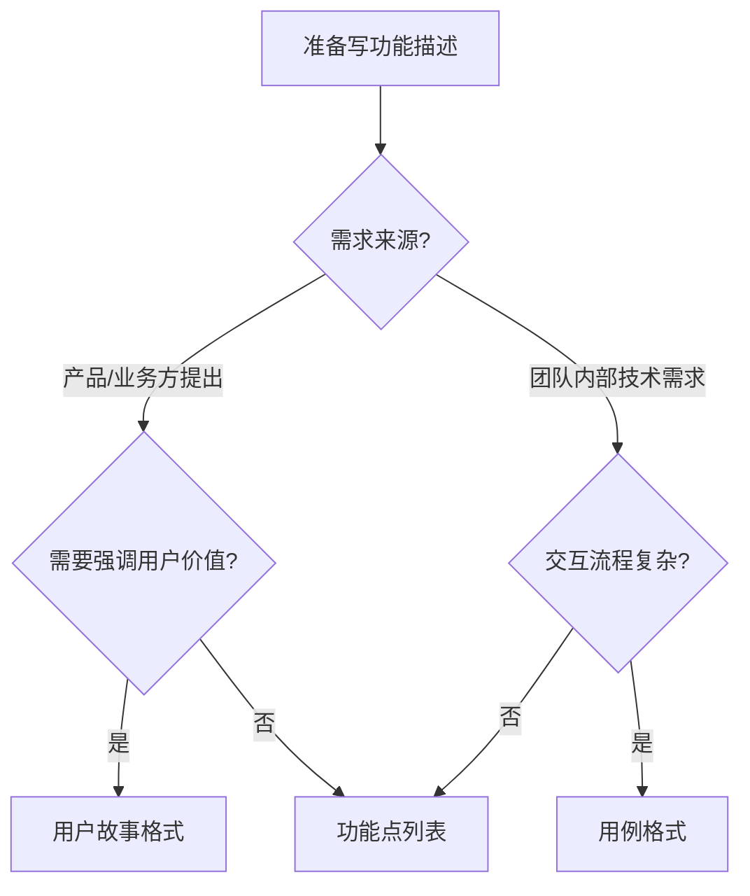

# 格式选择模块

## 三种格式

| 格式 | 适用场景 |
|------|---------|
| 功能点列表 | 需求明确、功能点独立、团队内部快速对齐 |
| 用户故事 | 需求来源于产品/业务方，需要强调用户价值 |
| 用例 | 交互流程复杂，需要精确描述操作路径 |

## 决策流程



## 用户故事模板

```markdown
- 作为 [角色]，我希望 [做什么]，以便 [达到什么目的]
```

## 用例模板

```markdown
- 用例名称：
- 前置条件：
- 操作步骤：1. ... 2. ... 3. ...
- 预期结果：
```

## 格式内容注入指引

格式选定后，返回对应的内容注入指引：

| 格式 | {{format_content}} 替换为 |
|------|--------------------------|
| 功能点列表 | `- 功能点1\n- 功能点2\n...` |
| 用户故事 | `- 作为 [角色]，我希望 [做什么]，以便 [达到什么目的]` |
| 用例 | `- 用例名称：\n- 前置条件：\n- 操作步骤：\n- 预期结果：` |
