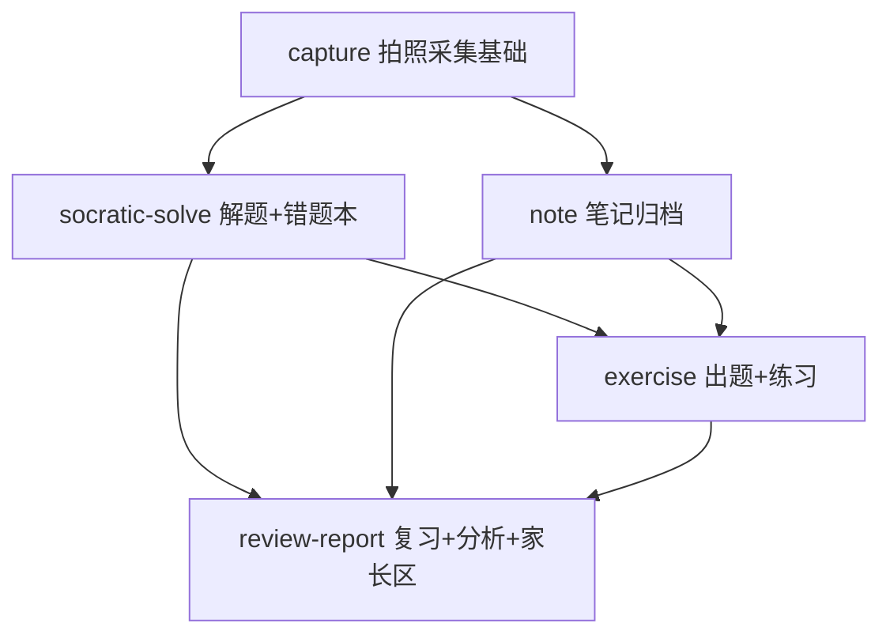

# sisterStudy 学习机 App Spec

## 背景

市面 AI 学习机（科大讯飞 / 学而思 / 作业帮，2000-10000 元档）的核心能力本质是「多模态识别 + 大模型讲解 + 学情数据」，而非硬件。开发者决定为妹妹（初中生）定制安卓平板学习 App 替代购买学习机。

项目复用 Toolbox 项目（D:\mySpace\Toolbox，微信小程序）已验证的云函数模式：processOcr 视觉识题（百炼 qwen3.6-flash）、任务队列 + 定时触发器异步架构、embedding 向量基建（智谱 embedding-3）。新项目使用独立云空间（**uniCloud 支付宝小程序云**），前端 uni-app **Vue 3 + 选项式 API**，Markdown 渲染用 markdown-it + mp-html。

产品三原则（准入标准：**"这个功能是在替她思考，还是让她思考？"**）：

1. **先提示后答案**——苏格拉底式引导阶梯 + 答案门槛，防抄作业
2. **零娱乐元素**——防沉迷依赖平板系统级未成年人模式，App 内不做
3. **个性化注入**——prompt 注入学生画像（年级 + 历史错误根因），基于个人错题/笔记积累，这是相对通用 AI 的不可替代性

需求推演过程见 [requirements-draft.md](../requirements-draft.md)，AI 教学原则全文见 [.claude/rules/ai-product-principles.md](../../.claude/rules/ai-product-principles.md)。

## 整体目标

在妹妹的安卓平板上交付完整学习闭环：**拍错题 / 拍笔记 → 苏格拉底式引导解题 / 归档标注 → 出题检验（真题优先）→ 练习自评 → 错题沉淀 → 间隔复习 → 薄弱点交叉分析 → 反哺出题**，分 M1（MVP）与 M2（学习机化）两期交付，M0 冒烟验证识别质量生死线。

## 子需求拆分

### 拆分说明

按「基础能力层 + 场景层」拆分：capture 是被所有采集场景复用的基础链路（对应 Toolbox learn-zone 的 multi-source-input 模式）；其余 4 个子 spec 按业务域划分，各自可独立交付，与里程碑对应（capture+socratic-solve+note → M1，exercise+review-report → M2）。

### 子需求列表

| 子需求 | 目录 | 简要说明 | 依赖 |
|--------|------|---------|------|
| 拍照采集基础能力 | [capture/](capture/spec.md) | 设备注册 + 拍照识题/识笔记 OCR 链路 + 修正提交 | 无（M0） |
| 解题引导与错题本 | [socratic-solve/](socratic-solve/spec.md) | 苏格拉底式引导树解题 + 错题沉淀与向量去重 | capture |
| 笔记归档 | [note/](note/spec.md) | 手写笔记拍照归档 + AI 知识点标注 + 向量化 | capture |
| 出题工作流与练习 | [exercise/](exercise/spec.md) | 真题优先出题（联网搜索→AI 兜底）+ 练习作答闭环 | capture、socratic-solve、note |
| 复习分析与家长区 | [review-report/](review-report/spec.md) | SM-2 间隔复习 + 薄弱点交叉分析 + 家长区报告 | socratic-solve、note、exercise |

### 依赖关系

## 整体验收标准

| 阶段 | 验收 |
|------|------|
| M0 冒烟（1 天） | processOcr 在新空间跑通；妹妹真实作业照片 10 张 + 手写笔记 10 张识别准确率可接受（**全项目生死线，不过则重新评估方案**）；M0 同时验证：云函数环境变量支持、HTTP 触发超时上限、uniCloud.httpclient 兼容性 |
| M1 MVP（约 3 周业余） | 妹妹能独立完成一次拍题解题（含引导阶梯）和一次拍笔记归档；引导树答案泄露率 0/10（回归测试集）；错题/笔记自动标注知识点 |
| M2 学习机化（2-3 周） | 出题来源标注（真题/AI）正确且真题占比可统计；练习做错自动流转错题本；复习自评影响下次调度时间；哥哥每周可查看家长区报告 |
| 全程 | 所有 AI 功能通过统一检验问题（替她思考 vs 让她思考）；API 消费有监控告警，无失控风险 |

## 变更记录
| 日期 | 作者 | 变更内容 |
|------|------|---------|
| 2026-09-12 | yuanchuang | 初始版本（父子拆分：capture / socratic-solve / note / exercise / review-report） |
